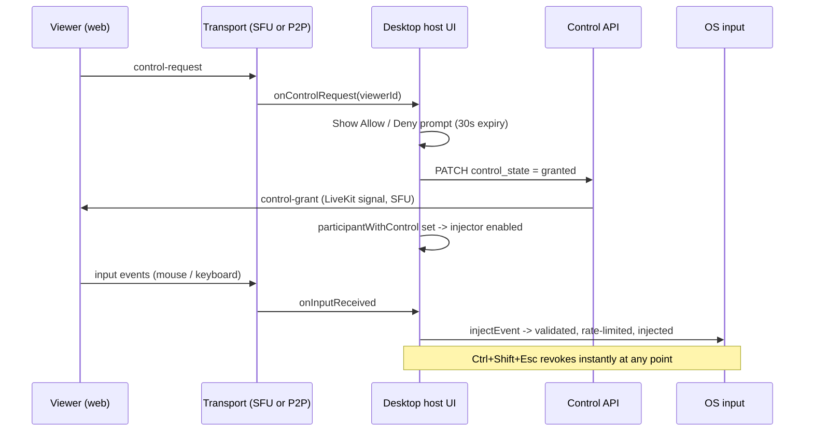

# PairUX Remote Control

How "let this participant drive my desktop" actually works, end to end.

The OS-level injection layer lives in a standalone package,
[`@profullstack/remote-input`](../packages/remote-input/README.md) — see its
README for backends, per-OS requirements, and the safety guarantees. This
document covers how PairUX drives it.

> Only the **desktop app** can be controlled. A web host shares a browser tab
> and has no OS to inject into, so web-hosted sessions leave control off
> (`apps/web/src/app/host/page.tsx`) rather than showing viewers a button that
> could never work.

---

## The two gates

Control is never implicit. Two independent things must be true:

1. **The session allows requests** — `session.settings.allowControl`. Set at
   session creation from the desktop's Settings toggle
   (`getDefaultAllowGuestControl()` in
   `apps/desktop/src/renderer/lib/sessionDefaults.ts`). When false, the viewer
   never renders a "Request control" button, and the host hooks drop any
   control-request or input message that arrives anyway.
2. **The host approved that participant** — the participant's `control_state`
   must be `granted` in the database. The host-side injector is enabled from
   that row, so approval is what actually opens the input path.

Gate 1 is a preference. Gate 2 is the security boundary: nothing is injected
until a human clicks **Allow control**.

---

## Flow



### Key files

| Concern                      | Location                                                                                  |
| ---------------------------- | ----------------------------------------------------------------------------------------- |
| Viewer input capture         | `apps/web/src/hooks/useRemoteControl.ts`                                                  |
| Viewer control UI            | `apps/web/src/components/control/`                                                        |
| Viewer transport (SFU / P2P) | `apps/web/src/hooks/useWebRTCSFU.ts`, `useWebRTC.ts`                                      |
| Host transport + gating      | `apps/desktop/src/renderer/hooks/useWebRTCHostSFUAPI.ts`, `useWebRTCHostAPI.ts`           |
| Host prompt, grant/revoke    | `apps/desktop/src/renderer/components/capture/CapturePreview.tsx`                         |
| Host injection hook          | `apps/desktop/src/renderer/hooks/useInputInjection.ts`                                    |
| Main-process facade          | `apps/desktop/src/main/input/injector.ts`                                                 |
| IPC + emergency hotkey       | `apps/desktop/src/main/ipc/input.ts`                                                      |
| OS injection + safety        | `packages/remote-input/`                                                                  |
| Control state persistence    | `apps/web/src/app/api/sessions/[sessionId]/participants/[participantId]/control/route.ts` |

---

## Transports

A session is either `sfu` (LiveKit, the default) or `p2p`. Control works on
both, over the same message shapes:

- **SFU** — messages ride LiveKit data packets (`publishData` /
  `RoomEvent.DataReceived`). Grants are additionally pushed server-side from the
  control API via `RoomServiceClient.sendData`, so a grant lands even if the
  host's own data channel is momentarily unhealthy.
- **P2P** — messages ride an `RTCDataChannel` named `control`.

Both host hooks expose the same surface (`onControlRequest`, `onInputReceived`,
`grantControl`, `revokeControl`), and `CapturePreview` picks one on
`session.mode`, so the control code above the transport is identical.

### Messages

```ts
// packages/shared-types/src/signaling.ts and input.ts
type ControlMessage =
  | { type: 'control-request'; participantId: string; timestamp: number }
  | { type: 'control-grant'; participantId: string; timestamp: number }
  | { type: 'control-revoke'; participantId: string; timestamp: number };

interface InputMessage {
  type: 'input';
  timestamp: number;
  sequence: number; // ordering
  event: InputEvent; // mouse or keyboard, coordinates normalized 0-1
}
```

Cursor positions travel as a separate `cursor` message, sent lossily (~60fps)
because a dropped cursor frame is irrelevant a frame later, while a dropped
click is not.

---

## Requests and approval

Guests are anonymous, so a viewer **cannot** write its own `control_state` — the
control API requires an authenticated user. Requests therefore arrive over the
data channel and are held in host-local state until answered:

- The host sees an **Allow control / Deny** prompt naming the participant.
- Unanswered requests expire after 30s (`CONTROL_REQUEST_TIMEOUT_MS`).
- **Allow** resolves the viewer id back to its participant row and PATCHes
  `control_state = granted`; the injector enables off that row.
- **Deny** sends `control-revoke` so the viewer leaves its "requested" state.
- A viewer disconnecting clears any pending request.

Only one participant holds control at a time: granting to a second viewer
revokes the first.

---

## One shared host pointer

PairUX drives the host's real system pointer for every guest movement, click,
scroll, and drag. There is no synthetic cursor, overlay cursor, pointer
borrowing, restoration, or compositor-specific cursor reader.

The host and guest therefore take turns naturally: when the guest stops moving,
the host can use the same physical pointer anywhere in the desktop. Input that
arrives at the same moment is ordered by the operating system like any other
input events.

## Coordinates

Mouse coordinates are normalized `0-1` relative to the shared surface, never
pixels — the viewer does not know the host's resolution, DPI, or monitor layout.
The host maps them using the captured video track's dimensions
(`inputScreenSize`), pushed down via `input:updateScreenSize` whenever the
capture source changes.

---

## Stopping control

| Mechanism          | Effect                                                                                                    |
| ------------------ | --------------------------------------------------------------------------------------------------------- |
| `Ctrl+Shift+Esc`   | Global hotkey. Releases every held key/button and disables injection immediately, regardless of UI state. |
| Host revokes       | PATCHes `control_state = view-only`; injector disables on the next session refresh.                       |
| Viewer releases    | Sends `control-revoke`.                                                                                   |
| Viewer disconnects | Host clears that viewer's control state.                                                                  |

Anything the remote user is holding is always released — on revoke, on
disconnect, when they alt-tab or leave the video, and by a five-second watchdog
if input simply stops mid-hold. A button left down would otherwise put the
host's desktop into a permanent drag that swallows every click, recoverable
only by rebooting.

The emergency hotkey is registered for the app's lifetime
(`apps/desktop/src/main/ipc/input.ts`) so it works even if the renderer is
wedged. Host input is never blocked while a viewer has control — the host can
always take over by simply using their own mouse and keyboard.

---

## Per-OS notes

Full requirements are in the
[package README](../packages/remote-input/README.md). In short:

- **macOS** — needs Accessibility permission; the app prompts via
  `systemPreferences.isTrustedAccessibilityClient(true)`
  (`apps/desktop/src/main/permissions/index.ts`).
- **Windows** — works out of the box; only elevated target windows need the app
  elevated too.
- **Linux/X11** — works out of the box.
- **Linux/Wayland (KDE)** — uses the compositor-approved XDG RemoteDesktop
  portal. KDE asks the host to approve each control session; PairUX closes the
  session on revoke. If the portal is unavailable or denied, remote control is
  kept disabled and `CapturePreview` shows the diagnostic rather than falling
  back to raw input injection.

Native modules are unpacked from the asar (`asarUnpack: '**/*.node'` in
`electron-builder.yml`), which packaged builds require.

---

## Testing

- `packages/remote-input` — safety layer, injector gating, backend selection,
  and both Wayland backends.
- `apps/desktop/src/main/input/injector.test.ts` — the full injection path
  against a mocked nut.js.
- `apps/desktop/src/renderer/hooks/useWebRTCHostSFUAPI.test.ts` — `allowControl`
  enforcement (requests and input dropped when the session disallows control).
- `apps/desktop/src/renderer/lib/sessionDefaults.test.ts` — the session-creation
  default that decides whether the viewer ever sees a request button.
